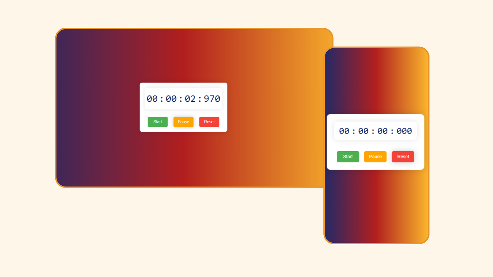

# Stopwatch Project

## Overview
This project is a simple yet functional stopwatch created as part of my internship at Prodigy Infotech. The stopwatch is built using HTML, CSS, and JavaScript, and is designed to be fully responsive, ensuring a seamless user experience across various devices.

## Features
- Start, stop, and reset functionality
- Responsive design for mobile and desktop views
- Clean and user-friendly interface
- Improved skills in web development technologies

## Technologies Used
- **HTML**: For the structure of the stopwatch
- **CSS**: For styling and responsive design
- **JavaScript**: For stopwatch functionality

